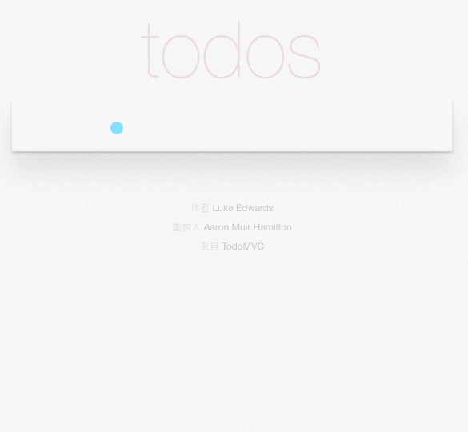

依据已经提供的 `html` `css` 模板，完成一个 Todo 应用。



# 前提

完成这个项目你需要一些基本的 javascript 的知识：

1. 对 javascript 的基础语法有所了解，并且该项目采用 es2015 的语法，因此你必须了解 es2015 的语法，比如：
   * 如何写类
   * 如何使用 `import` 
   * 如何用 `=>` 创建函数
   * 如何使用 `let` `const`
2. 知道如何利用 javascript 操纵 DOM 元素，比如
   * 如何创建一个元素
   * 如何把它插入到 dom 中
   * 如何删除一个元素
   * 如何用 `querySelector` 选择元素
3. 知道如何 DOM 的事件模型以及如何为 DOM 元素绑定不同种类的事件，该项目可能会涉及到如下的内容：
   * 如何绑定键盘事件
   * 如何绑定鼠标单击事件
   * 如何绑定双击事件
   * DOM 的事件传播方式是什么样子的

并且，你需要知道一些 `git` 的基本使用方式：

* 知道如何 `clone` 远端的 `git` 仓库
* 知道如何将添加或者修改后的文件提交到本地 `git` 仓库
* 知道如何将本地的仓库提交到远端的仓库

本项目使用的构建工具是 `webpack`，你有必要对其有一些基本的了解，明白其 `entry` `loader` 的概念。

还有，你可能需要知道一些 `nodejs` 以及 `npm` 的知识，**不过在目前这个项目，这些不是必须的**：

* 知道什么是 `nodejs`
* 知道如何利用 `npm` 对 HTML Javascript 的项目进行依赖管理

# 环境

为了构建这个项目，你需要至少将下面加 `*` 的东西安装到你的电脑上：

1. [`git`](https://git-scm.com/) `*`
2. `nodejs` 
3. `npm`

# 构建

项目中提供了 `index.html` `src/app.js` `src/helpers.js` `src/template.js` 等几个文件。其中 `index.html` 提供了项目的基本 `html` 标签；`src/helpers.js` 提供了一些基本的帮助函数，比如查找 dom 元素、绑定 dom 事件；`src/template.js` 提供了 todo 元素以及 todo 列表的状态栏的模板。

该项目包含如下几个功能：

1. 创建一个新的 Todo，其模板在 `src/template.js` 中，当 todo 列表不为空时，显示下面的 `.main` 元素
2. 把已经创建的 Todo 标记为已完成，需要将 `completed` 的类添加到 `.todo-list li` 元素上
3. 删除一个 Todo，需要将 todo li 元素从 dom 节点中清除
4. 显示当前有多少个 Todo 还没有完成，其模板在 `src/template.js` 中，请将其添加到 `.main footer .todo-count` 中

**注意**，由于测试需要采用 css selector 定位元素并测试页面的交互，请严格按照以上的要求将指定的 class 添加到指定的元素上用以表现元素状态的变化而不是自己直接去写 style，并且一定使用 `src/template.js` 下的模板而不是自己写其他的模板，否则即使其效果与页面要求相似也会导致测试的失败。同时，请不要修改除去 `src/app.js` 文件外的其他文件，在测试时会覆盖其他文件的修改。


# 在本地执行测试

首先，这一步不是必须的。

按照下面的步骤安装必要的工具：

1. 安装 [node.js](https://nodejs.org/en/)
2. 安装 [Selenium](http://nightwatchjs.org/gettingstarted#selenium-server-setup)
2. 安装 [nightwatch](http://nightwatchjs.org/gettingstarted#installation)

然后执行以下命令安装其他依赖

```
$ npm install
```

在本地执行测试，首先需要启动 selenium，并使其端口为 `4444`

```
$ cd test
$ nightwatch
```